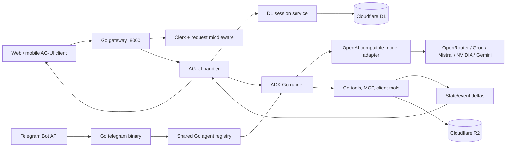

# Go Agent Runtime Migration Design

**Date:** 2026-07-09  
**Status:** Approved architecture, pending implementation plan  
**Scope:** Replace every Python runtime under `agents/` with Go while keeping the active AG-UI product surfaces functional.

## Goal

Replace the Python ADK/FastAPI gateway and Telegram bot with Go binaries built
on ADK-Go and a repository-owned AG-UI implementation. The Railway gateway
must run below 400 MB RSS under normal representative use, use Cloudflare D1
for all durable session state and Cloudflare R2 for artifacts, and retain
LiteLLM-equivalent multi-provider behavior through an in-process,
OpenAI-compatible Go model adapter.

## Constraints

- Every runtime in `agents/` becomes Go. No Python runtime, `uv`, FastAPI,
  Google ADK Python, LiteLLM, or Node MCP child process ships in either
  production image.
- The gateway uses ADK-Go and an in-repository AG-UI adapter. The
  `sicko7947/adk-agui-converter` repository is source material for event
  conversion only; it is not a production dependency.
- Production persistence is Cloudflare D1 for sessions/state/rate limits and
  Cloudflare R2 for artifacts. `DATABASE_URL`, Postgres, Turso, and local
  database fallbacks are removed.
- Existing stored Python sessions do not migrate. Cutover starts a new Go
  session schema.
- Active web and mobile clients keep working without a coordinated frontend
  rewrite. The Go gateway therefore retains the current route map and AG-UI
  semantics that those clients use.
- Model routing remains provider-agnostic. Explicit current model IDs and
  provider fallbacks stay configurable; no move to Gemini-only behavior is
  allowed.
- The Telegram runtime becomes Go and shares agent definitions/tool behavior
  with the gateway.
- Improve security, operability, reliability, and memory use where the Python
  audit found a concrete problem.

## Non-goals

- Importing old Python ADK sessions/events into D1.
- Supporting the unmounted, source-less `agents/a2ui` fixture as an agent.
- Preserving Python eval/GEPA tooling. Equivalent Go fixtures and protocol
  tests replace runtime coverage; prompt optimization can be reconsidered as a
  separate future concern.
- Running a LiteLLM proxy or Python sidecar in Railway.

## Target Runtime



`agents/` becomes one Go module with two independently deployed binaries:

```text
agents/
  go.mod
  go.sum
  cmd/
    gateway/main.go
    telegram/main.go
  internal/
    agentruntime/       # registry, common ADK configuration, state helpers
    agents/             # one package per gateway agent
    agui/               # HTTP endpoints, input normalization, SSE conversion
    auth/               # Clerk JWT verification and route policy
    cloudflare/         # D1 REST service and R2 artifact client
    config/             # validated environment/provider configuration
    mcp/                # HTTP/stdio-independent MCP and provider auth helpers
    providers/          # OpenAI-compatible ADK-Go model implementation
    rate/               # D1-backed provider and user request limits
    telegram/           # bot routing, linking, chunking, polling
    observability/      # OTEL setup, metrics, structured logging
  assets/
    oralboards/search.sqlite
  migrations/
    d1/                 # idempotent Go-schema DDL
  testdata/
    agui/               # input/event golden fixtures
```

The Python package layout, `pyproject.toml`, `uv.lock`, Python Dockerfiles,
and Python runtime tests are deleted after their Go replacements are passing.
The repository may retain non-runtime Python utilities outside `agents/` only
when they are still actively used; otherwise they are replaced or deleted.

## HTTP and AG-UI Contract

The gateway retains these public endpoints at port 8000:

| Route                            | Behavior                                                                            |
| -------------------------------- | ----------------------------------------------------------------------------------- |
| `GET /health`                    | D1/R2 readiness and process metadata; no database fallback.                         |
| `POST /<agent>/agui`             | Parse a full AG-UI `RunAgentInput` and stream SSE.                                  |
| `GET /<agent>/agui/capabilities` | Advertise the features actually implemented by the Go runtime.                      |
| `POST /<agent>/agents/state`     | Read the Go-owned current state and messages for one authenticated app/user/thread. |
| `GET /<agent>/health`            | Agent readiness, including required asset/config checks.                            |
| `POST /telegram/link/consume`    | Consume a one-time Telegram account-link token.                                     |

The 12 mounted route prefixes stay: `excalidraw`, `travel`, `trends`,
`grocery`, `fitness`, `wellness`, `expense`, `oralboards`, `presentation`,
`research`, `spreadsheet`, and `resume`.

### AG-UI handler responsibilities

`internal/agui` owns behavior that the example converter does not implement:

1. Parse the entire AG-UI request: messages, state, context, client tools,
   thread/run IDs, and tool-result/resume messages.
2. Derive authenticated identity before resolving a session. The external
   `x-clerk-user-id` header is never trusted when a Clerk JWT is present.
3. Create or restore the Go-owned D1 session with identity key
   `(app_name, user_id, thread_id)`.
4. Overlay request-only state for OAuth credentials and client tool metadata
   without persisting it.
5. Convert incoming AG-UI messages to ADK-Go content, including function
   responses that resume approvals and oral-board questions.
6. Invoke ADK-Go with streaming enabled and convert every result to typed
   AG-UI SSE frames: run lifecycle, text, reasoning, tool call/result, state
   snapshot/delta, activities/A2UI, errors, and custom events.
7. Persist state/event mutations atomically in D1 and flush each SSE frame.
8. End the run with `RUN_FINISHED` or a sanitized `RUN_ERROR`; never leak
   provider keys, OAuth tokens, raw database errors, or stack traces.

State changes use RFC 6902 JSON Patch operations. New keys emit `add`; existing
keys emit `replace`; JSON Pointer segments are escaped. Every first response
and state-reconnect response includes a `STATE_SNAPSHOT`, which avoids relying
on a client-side history of patches.

### Client tools and human-in-the-loop work

The Go equivalent of Python `AGUIToolset` is a dynamic client-tool proxy:

- It exposes only tools supplied by the current `RunAgentInput`.
- It creates stable AG-UI tool-call IDs and persists a pending invocation in
  D1 before emitting `TOOL_CALL_*` events.
- A later tool result is matched to exactly one pending call, converted to an
  ADK function response, and resumes the correct agent invocation.
- Travel/grocery approval, oralboards question interactions, and Trends A2UI
  flows receive dedicated protocol-golden tests.
- Pending calls expire with their one-hour session TTL and cannot be completed
  by a different user, app, or thread.

## Storage and State

### Cloudflare D1 is mandatory

`internal/cloudflare/d1` implements ADK-Go's `session.Service` plus the small
gateway state-query API. It calls Cloudflare's D1 SQL API with batched
parameterized statements, using these mandatory variables:

| Variable                  | Purpose                        |
| ------------------------- | ------------------------------ |
| `CF_ACCOUNT_ID`           | Cloudflare account identifier. |
| `CF_API_TOKEN`            | D1/R2 scoped API token.        |
| `CF_D1_DATABASE_ID`       | D1 database identifier.        |
| `CF_R2_BUCKET_NAME`       | R2 artifact bucket.            |
| `CF_R2_ACCESS_KEY_ID`     | R2 S3 access key.              |
| `CF_R2_SECRET_ACCESS_KEY` | R2 S3 secret.                  |

Gateway startup fails fast if any required D1/R2 setting is absent. No
`DATABASE_URL`, `TURSO_DATABASE_URL`, SQLite persistence, or in-memory
production fallback is accepted.

The new D1 schema is intentionally Go-owned and separate from the Python ADK
tables:

```sql
CREATE TABLE IF NOT EXISTS agent_sessions (
  app_name TEXT NOT NULL,
  user_id TEXT NOT NULL,
  thread_id TEXT NOT NULL,
  state_json TEXT NOT NULL,
  messages_json TEXT NOT NULL,
  expires_at INTEGER NOT NULL,
  version INTEGER NOT NULL,
  created_at INTEGER NOT NULL,
  updated_at INTEGER NOT NULL,
  PRIMARY KEY (app_name, user_id, thread_id)
);

CREATE TABLE IF NOT EXISTS agent_events (
  id TEXT PRIMARY KEY,
  app_name TEXT NOT NULL,
  user_id TEXT NOT NULL,
  thread_id TEXT NOT NULL,
  run_id TEXT NOT NULL,
  event_json TEXT NOT NULL,
  created_at INTEGER NOT NULL
);

CREATE TABLE IF NOT EXISTS agent_app_state (
  app_name TEXT PRIMARY KEY,
  state_json TEXT NOT NULL,
  version INTEGER NOT NULL,
  updated_at INTEGER NOT NULL
);

CREATE TABLE IF NOT EXISTS agent_user_state (
  app_name TEXT NOT NULL,
  user_id TEXT NOT NULL,
  state_json TEXT NOT NULL,
  version INTEGER NOT NULL,
  updated_at INTEGER NOT NULL,
  PRIMARY KEY (app_name, user_id)
);

CREATE TABLE IF NOT EXISTS pending_client_tools (
  call_id TEXT PRIMARY KEY,
  app_name TEXT NOT NULL,
  user_id TEXT NOT NULL,
  thread_id TEXT NOT NULL,
  tool_name TEXT NOT NULL,
  arguments_json TEXT NOT NULL,
  expires_at INTEGER NOT NULL,
  created_at INTEGER NOT NULL
);

CREATE TABLE IF NOT EXISTS provider_limits (
  provider TEXT NOT NULL,
  window_start INTEGER NOT NULL,
  request_count INTEGER NOT NULL,
  PRIMARY KEY (provider, window_start)
);
```

All user/session rows are scoped in every `WHERE` clause. The Go D1 session
service follows ADK-Go state scopes: `app:` deltas update `agent_app_state`,
`user:` deltas update `agent_user_state`, and ordinary keys update
`agent_sessions.state_json`; reads merge those three layers. Request-scoped
keys such as `temp:kroger_token` and `temp:strava_token` live only in the
invocation overlay and are excluded from every persisted state/event payload,
log, and error message.

### R2 artifacts

`internal/cloudflare/r2` uses Go's S3-compatible client. It retains a
deterministic app/user/thread/key layout but does not attempt to interpret
Python artifact serialization. New artifacts use content type, SHA-256,
created-at metadata, and bounded object sizes. Downloads verify user/session
ownership before issuing a response or URL.

## Authentication and Security Improvements

- Clerk JWKS verification runs before all stateful routes, including
  `/<agent>/agents/state`. `/resume` remains explicitly public.
- The verified Clerk `sub` replaces any client-provided identity header. For
  public resume usage, the server generates a non-privileged anonymous identity
  per request/thread.
- OAuth bearer values supplied by the web proxy are redacted from logs and stay
  invocation-scoped. Kroger/Strava tool construction receives a token through
  a request-aware transport, not global mutable configuration.
- D1/R2 credentials are validated at startup but never echoed in health output.
- CORS uses `ALLOWED_ORIGINS`; wildcard origins are rejected when credentials
  are enabled.
- Body size, client-tool argument size, artifact size, tool-call depth, and
  model output duration are bounded. Context cancellation terminates upstream
  HTTP/MCP calls.
- Every route has structured request IDs and OpenTelemetry trace propagation.

## Provider Layer

`internal/providers/openai` implements ADK-Go's `model.LLM` interface over
OpenAI-compatible chat-completions APIs. A provider config describes endpoint,
API-key environment variable, model alias, request timeout, concurrency limit,
and fallback order. The adapter supports:

- streamed text and reasoning deltas;
- tool/function call argument deltas and final calls;
- tool results supplied on the next invocation;
- provider-specific error classification (rate limit, retryable network,
  invalid request, terminal authentication error);
- bounded exponential retry with jitter only for retryable failures;
- a circuit breaker and D1-backed window counter per provider;
- per-agent explicit primary model plus configured fallback models.

Gemini direct ADK-Go usage is retained only where it is technically necessary
for current A2UI/reasoning behavior. It sits behind the same provider interface
and does not change the multi-provider policy.

No proxy process is required. This removes the Python LiteLLM memory footprint
while preserving its routing role in Go.

## Tool and MCP Strategy

All domain state tools become small typed Go functions. They receive a
request-scoped state transaction rather than mutating global state. The
transaction validates the agent's declared state shape, records only changed
fields, and emits state deltas after D1 commit.

| Existing integration      | Go implementation                                                            |
| ------------------------- | ---------------------------------------------------------------------------- |
| Brave stdio MCP           | Direct Brave Search HTTP client; no Node process.                            |
| TRVL streamable HTTP MCP  | Go HTTP MCP client with context/timeout.                                     |
| Kroger HTTP MCP           | Request-aware Go HTTP MCP transport injecting the ephemeral bearer token.    |
| Strava REST API           | Typed Go HTTP client injecting the ephemeral bearer token.                   |
| Excalidraw remote MCP/App | Go remote MCP client plus AG-UI activity/custom event bridge.                |
| BigQuery                  | Official Go BigQuery client with service-account or ADC configuration.       |
| Oralboards corpus         | Read-only SQLite FTS queries via Go SQLite driver.                           |
| A2UI                      | Typed A2UI activity/custom-event builder validated against frontend catalog. |

MCP clients have a bounded lifecycle: they are cached by stable endpoint and
credential-free configuration, while request-specific authorization is applied
per call. A user's OAuth token never becomes a cache key, connection-global
header, or log attribute.

## Agent Port Matrix

Every agent carries forward its instruction text and explicit state model as Go
embedded assets/types. The registry declares route prefix, app name, state
factory, model policy, tools, health prerequisites, and optional predicted
streaming fields.

| Agent        | Go package responsibilities                                  | Required improvement/tests                               |
| ------------ | ------------------------------------------------------------ | -------------------------------------------------------- |
| Resume       | Public grounded Q&A; embedded resume.                        | Public-route auth test and grounding fixture.            |
| Presentation | Slide state and six deterministic tools.                     | State mutation/index ordering table tests.               |
| Research     | Canvas/report tools and source updates.                      | Section rebuild/order protocol tests.                    |
| Spreadsheet  | Sheet/row CRUD and active-sheet state.                       | Bounds/error/idempotency tests.                          |
| Expense      | Review/approval workflow and report streaming.               | Threshold/state-transition plus streamed-field tests.    |
| Excalidraw   | Remote MCP/App activity bridge.                              | Activity and tool-result resume fixture.                 |
| Travel       | Trip state, TRVL MCP, approval, itinerary/flights streaming. | Approval resume and markdown-stream state test.          |
| Fitness      | Strava, Brave HTTP, training-plan state.                     | Request-token isolation and provider timeout test.       |
| Grocery      | Kroger, Brave HTTP, web load, compaction.                    | OAuth isolation, compaction, cart safety test.           |
| Wellness     | In-process grocery/fitness orchestration.                    | Shared-state/subagent and cancellation test.             |
| Trends       | BigQuery, SQL agent, Brave HTTP, A2UI.                       | SQL validation, credentials, A2UI catalog fixture.       |
| Oralboards   | Four phase agents, deterministic router, SQLite FTS.         | Routing, one-probe bound, pause/resume and corpus tests. |

The unmounted `agents/a2ui` eval-only fixture is deleted. Trends remains the
sole owner of active A2UI behavior.

### Oralboards

Oralboards uses explicit Go orchestration rather than depending on an ADK-Go
workflow adapter. A phase router selects `case_builder`, `questioner`,
`evaluator`, or `scorer` from persisted state. The evaluator may chain to one
questioner/scorer phase under the same bounded rules as the current custom
orchestrator. The 21 MB SQLite corpus is opened read-only at startup and query
results are capped to control memory and prompt size.

### Wellness

Wellness uses a shared invocation state transaction and calls the grocery and
fitness agent builders directly. It does not make loopback HTTP calls or create
an independent session. Cancellation and state conflict behavior are tested.

### Trends

Trends splits SQL generation/validation, query execution, and A2UI rendering
into small ADK-Go agents/tools. BigQuery credential loading occurs once at
startup and health reports a configuration failure without exposing credential
details. Generated SQL remains allowlisted and dry-validated before execution.

## Telegram Runtime

`cmd/telegram` replaces the Python polling service. It shares the same Go agent
registry, provider router, D1 session service, OAuth/account-link model, and
tool contracts. Telegram-specific logic handles updates, account-link consume
flow, topic/thread-to-session mapping, chat history compaction, safe Markdown
chunking, typing indicators, and retry/backoff. It has no AG-UI HTTP server and
does not load web-only A2UI/client-tool code.

The binary uses one D1 namespace/schema but a distinct app name/session key so
Telegram conversations cannot collide with AG-UI threads.

## Deployment and Memory

### Images

- `agents/Dockerfile` becomes a multi-stage Go build for `cmd/gateway`.
- `agents/Dockerfile.telegram` becomes a multi-stage Go build for
  `cmd/telegram`.
- Final images contain the compiled binary, CA certificates, `/app/assets` for
  oralboards, and timezone data only when a tool requires it.
- They contain no Python interpreter, virtual environment, `uv`, Node runtime,
  global npm packages, or compiler toolchain.
- Builds use `go build -trimpath -ldflags='-s -w'`; reproducibility metadata is
  supplied through build args rather than a mutable runtime dependency.

### Memory controls

No `GOMEMLIMIT` is configured. Instead the service avoids the current costly
runtime layers and bounds work directly:

- global and per-provider semaphore limits;
- request, model, MCP, and BigQuery deadlines;
- capped request/context/tool/event/artifact sizes;
- streaming writes instead of aggregating model output in memory;
- single read-only SQLite handle for oralboards and bounded FTS result size;
- HTTP transport connection limits and idle cleanup;
- no Node/Brave subprocess, Python VM, or ORM pool in the gateway.

The measured acceptance criterion is Railway gateway RSS below 400 MB after a
warm-up period and during a representative concurrent AG-UI smoke run. The
Telegram service is measured separately because it is a separately deployed
process.

## Error Handling and Operations

- Startup fails if D1, R2, Clerk (when enabled), a required provider, or a
  required agent asset is unavailable. Health reports `degraded` with a stable
  error code, not secret-bearing diagnostics.
- Request errors return valid AG-UI error lifecycle events after `RUN_STARTED`
  only when a run began; validation/auth errors return normal HTTP 4xx before a
  stream opens.
- Tool mutations are committed transactionally before their corresponding state
  delta is emitted. A failed commit emits no optimistic state update.
- Retried provider calls are observable in OTEL but redact prompts and secrets.
- D1 write conflicts retry a bounded number of times using the session update
  marker; exhausted conflicts return a retryable AG-UI error.
- Session/event/pending-tool cleanup deletes expired rows in a bounded startup
  and periodic task. Cleanup failure never deletes active data.
- Root and per-agent health endpoints include version, D1/R2 readiness, and
  required local asset checks. They do not call external model providers.

## Testing and Completion Evidence

### Automated tests

1. Go unit tests for every state model/tool, provider error classifier, D1
   query builder, R2 key authorization, Clerk identity policy, and Telegram
   chunk/session mapper.
2. AG-UI golden tests replay complete requests and assert exact typed SSE event
   order/payloads for text, reasoning, state, tool calls, tool results,
   approvals, oralboards questions, and A2UI activity.
3. Per-agent integration tests run against a fake streaming model, fake D1/R2,
   and deterministic HTTP/MCP fixtures; no real cart/booking action executes.
4. HTTP integration tests cover all 12 prefixes, root/agent health routes,
   public resume, protected state routes, CORS, malformed AG-UI input, and
   identity isolation.
5. Telegram integration tests feed stored Bot API updates and validate routing,
   account-link, topic session isolation, and chunking.
6. `go test -race ./...`, `go vet ./...`, static analysis, and a production
   image smoke test are required in CI.

### Deployment verification

1. Build both images without Python/Node runtime layers and inspect their
   manifests.
2. Run local container smoke tests with D1/R2 HTTP fakes and capture RSS.
3. Deploy the Go gateway to Railway with the mandatory Cloudflare environment.
4. Run authenticated web AG-UI smoke flows for every agent, plus a direct
   mobile-compatible request, approval resume, oralboards interaction, Trends
   A2UI, Kroger/Strava header injection, and Telegram update smoke test.
5. Observe Railway process RSS after warm-up and a representative concurrent
   load. Record a value below 400 MB as the release acceptance artifact.
6. Remove Python runtime packages/images/configuration only after the Go
   services pass the above checks.

## Explicit Migration Sequence

1. Establish Go module, CI, immutable config validation, D1/R2, Clerk, and
   AG-UI protocol foundation with golden tests.
2. Implement OpenAI-compatible model routing and generic function/client/MCP
   tools.
3. Port simple stateful agents, then authenticated HTTP/MCP agents.
4. Port Wellness, Trends, and Oralboards orchestration/A2UI/corpus behavior.
5. Port Telegram using the common registry and session store.
6. Replace Docker/dev/CI/Railway wiring, delete Python runtime code, and run
   full verification including Railway RSS.

This order is implementation sequencing only; the release is not complete
until every item is ported and the final Go deployment meets the full
verification criteria.
